# Simulación BARW y ecuaciones de reacción-difusión

Este repositorio contiene una implementación numérica orientada al estudio de procesos de crecimiento ramificado tipo BARW (*Branching and Annihilating Random Walks*) y de ecuaciones de reacción-difusión relacionadas, en particular la ecuación de Fisher--KPP. Además, se incluyen scripts de validación numérica y varios benchmarks para comparar la búsqueda exhaustiva con estructuras espaciales basadas en `cKDTree` y quadtree.

## Estructura general

El código se organiza en torno a dos bloques principales:

1. **Simulación BARW**: generación de conductos ramificados mediante puntas activas que avanzan, se bifurcan, terminan o se aniquilan al encontrarse con otros conductos.
2. **Modelos continuos de reacción-difusión**: resolución numérica de la ecuación del calor y de Fisher--KPP mediante esquemas de diferencias finitas, con comprobaciones de convergencia y velocidad del frente.

Las figuras generadas por los scripts principales se guardan en la carpeta `resultados/`. Además, se incluyen resultados complementarios en `paquetes_cerrados/`.

## Requisitos

Para ejecutar los scripts es necesario tener instaladas las siguientes librerías de Python:

```bash
pip install numpy scipy pandas matplotlib
```

Además, los scripts utilizan módulos propios del proyecto situados en la carpeta `src/`, por ejemplo `src.barw`, `src.malla`, `src.calor` y `src.fisherkpp`.

## Scripts principales

### `barw.py`

Este script ejecuta la simulación principal del modelo BARW. Primero crea una configuración mediante `BARWConfig`, después inicializa la simulación con `SimulacionBARW` y finalmente ejecuta el modelo.

La simulación permite seleccionar el método de búsqueda espacial mediante el parámetro `metodo_busqueda`:

```python
metodo_busqueda = 0  # 0: exhaustiva, 1: cKDTree, 2: quadtree
```

Las modalidades disponibles son:

- `0`: búsqueda exhaustiva, utilizada como referencia.
- `1`: búsqueda mediante `cKDTree`.
- `2`: búsqueda mediante quadtree con inserción incremental.

Al finalizar, el script genera dos tipos de figuras:

- `resultados/barw_conducto_kdtree.png` o `resultados/barw_conducto_exhaustiva.png`: representación espacial del conducto generado.
- `resultados/barw_historial_kdtree.png` o `resultados/barw_historial_exhaustiva.png`: evolución temporal de magnitudes como puntas activas, bifurcaciones o terminaciones.

También se incluye código comentado para ejecutar la simulación con distintas semillas y comparar resultados como el número de segmentos, bifurcaciones, terminaciones, puntas finales y avance máximo en la dirección `x`.

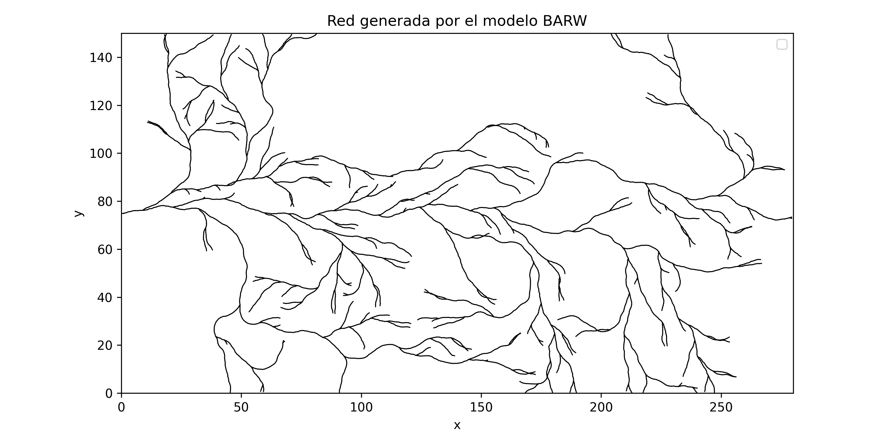
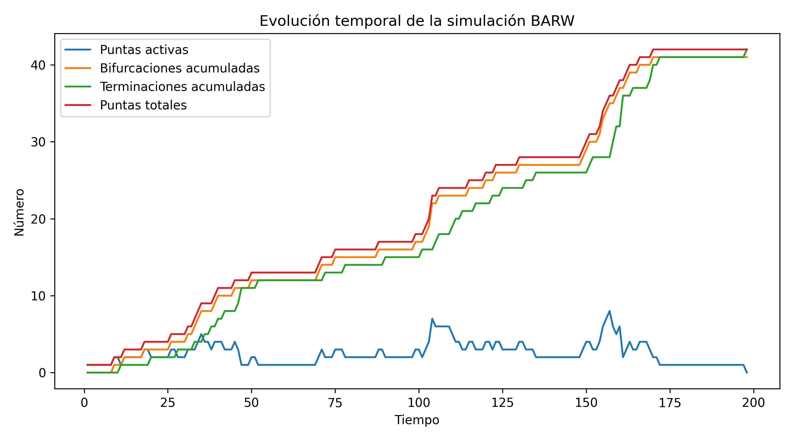

## Benchmark de búsqueda espacial

### `benchmark_kdtree.py`

Este script compara el coste computacional de dos métodos para buscar vecinos dentro de un radio fijo:

1. **Búsqueda exhaustiva**: para cada punto de consulta se calcula la distancia a todos los puntos almacenados.
2. **Búsqueda con `cKDTree`**: se construye un árbol espacial y se usa `query_ball_point` para encontrar los puntos dentro del radio indicado.

El experimento genera puntos aleatorios en dimensión dos para varios tamaños:

```python
tamanos = [100, 1000, 10000, 100000]
```

y mide el tiempo mediano de ejecución tras varias repeticiones. También comprueba que ambos métodos devuelven los mismos vecinos mediante una comparación de los índices encontrados.

El script guarda:

- `resultados/resultados_kdtree.csv`: tabla con los tiempos de ejecución y la aceleración obtenida.
- `resultados/benchmark_kdtree.png`: figura log-log que compara el tiempo de búsqueda exhaustiva frente al tiempo usando `cKDTree`.

### Figura: comparación entre búsqueda exhaustiva y `cKDTree`

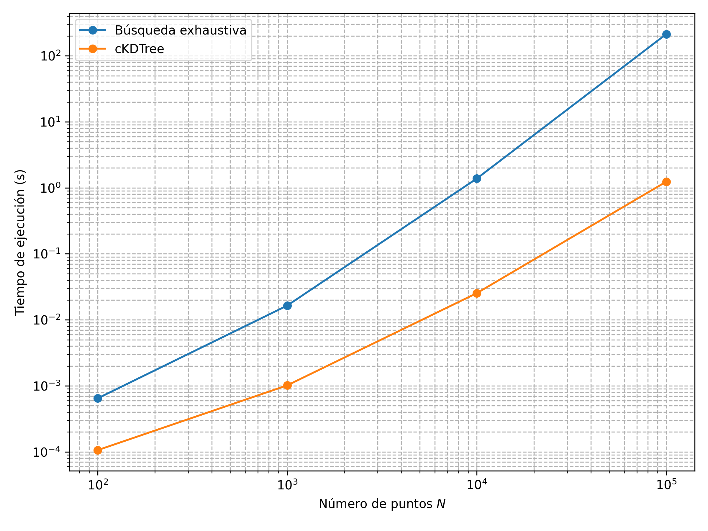

Esta figura muestra el tiempo de ejecución en función del número de puntos `N`, usando escala log-log. La búsqueda exhaustiva crece mucho más rápido porque compara cada consulta con todos los puntos. En cambio, `cKDTree` organiza previamente los puntos en una estructura espacial, lo que reduce el coste de las consultas de proximidad. Este benchmark justifica el uso de `cKDTree` dentro del simulador BARW, donde es necesario comprobar repetidamente si una punta está cerca de otros segmentos o puntos del conducto.

> Nota: si la búsqueda exhaustiva para `N=100000` tarda demasiado, puede limitarse la medición exhaustiva a tamaños menores, por ejemplo `N <= 10000`, y dejar `NaN` para los tamaños grandes.


### `scripts/benchmark_completo_barw.py`

Este script amplía el benchmark preliminar y compara tres estrategias de búsqueda espacial sobre una geometría generada por el propio modelo BARW:

1. búsqueda exhaustiva;
2. búsqueda mediante `cKDTree`;
3. búsqueda mediante quadtree.

Para distintos números de puntos de conducto \(N\), el script construye cada índice, ejecuta el mismo conjunto de consultas radiales y registra por separado:

- el tiempo de construcción o inserción;
- el tiempo dedicado a las consultas;
- el tiempo total;
- la aceleración respecto de la búsqueda exhaustiva;
- el número de consultas cuyos vecinos no coinciden con el método de referencia.

Cada medición se repite varias veces y se utiliza la mediana como valor representativo. La comparación de los conjuntos de vecinos permite comprobar que la mejora temporal no modifica la regla de aniquilación.

El script genera, entre otros, los siguientes archivos:

- `resultados/benchmark_completo_barw/data/benchmark_busqueda.csv`
- `resultados/benchmark_completo_barw/figures/benchmark_completo_barw.png`
- `resultados/benchmark_completo_barw/figures/benchmark_completo_barw.pdf`

### Prueba preliminar multisemilla

Antes del benchmark controlado se realizó una comparación de la simulación completa con búsqueda exhaustiva y `cKDTree` sobre 50 semillas. La siguiente figura muestra el tiempo total de ejecución frente al número de segmentos generados:

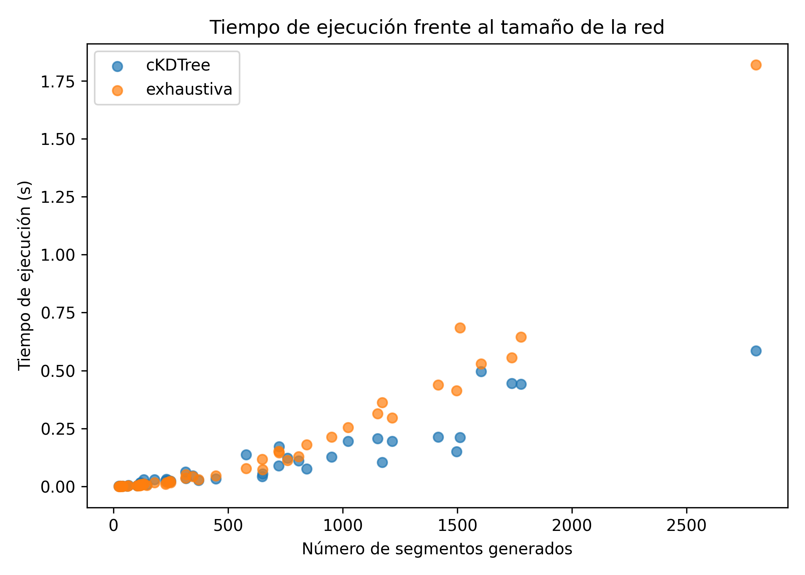

### Benchmark completo: exhaustiva, `cKDTree` y quadtree

La figura siguiente resume el escalado temporal, la aceleración frente a la búsqueda exhaustiva y la descomposición del coste entre construcción y consultas:

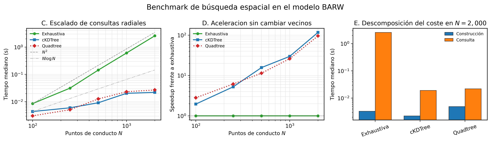

Los resultados muestran que `cKDTree` obtiene el menor tiempo total en los tamaños estudiados. El quadtree implementado también reduce de forma notable el coste respecto de la búsqueda exhaustiva, aunque presenta un mayor sobrecoste que `cKDTree` debido a su implementación recursiva en Python.

## Validación de la ecuación del calor

### `test_inicial.py`

Este script valida el método de Euler explícito aplicado a la ecuación del calor en una dimensión. Usa como dato inicial una función seno y compara la solución numérica con la solución exacta en el tiempo final.

También calcula el parámetro de estabilidad:

```python
lambda_ = D * dt / dx**2
```

que debe cumplir la condición de estabilidad del método explícito. Después ejecuta varios refinamientos de malla y calcula el error máximo para comprobar que el error disminuye al aumentar el número de nodos espaciales y temporales.

### `test_cn.py`

Este script realiza una validación análoga, pero usando el método de Crank--Nicolson para la ecuación del calor. Se comparan distintos refinamientos de malla y se calcula el orden observado de convergencia a partir de los errores máximos.

Estos dos scripts sirven para verificar que los métodos numéricos básicos implementados en el proyecto se comportan correctamente antes de aplicarlos a modelos más complejos.

## Ecuación de Fisher--KPP

### `test_fisher.py`

Este script resuelve la ecuación de Fisher--KPP mediante Euler explícito. Se utiliza un dato inicial tipo escalón y se representa la evolución del perfil de la solución en tres instantes: inicial, intermedio y final.

Además, calcula la posición del frente como el punto donde la solución alcanza el nivel `K/2`. A partir de esa posición se ajusta una recta para estimar numéricamente la velocidad de propagación del frente y compararla con la velocidad teórica:

```python
v = 2 * sqrt(r * D)
```

El script genera:

- `resultados/fisher_kpp_euler_perfiles.png`
- `resultados/fisher_kpp_euler_posicion_frente.png`

### Figura: perfiles de Fisher--KPP con Euler explícito

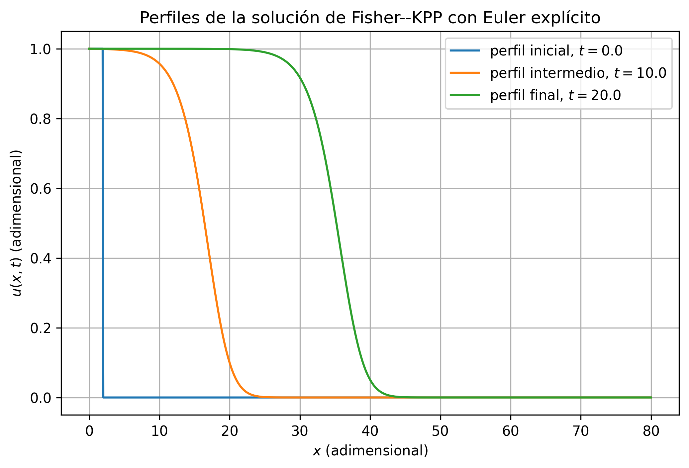

La figura muestra cómo una condición inicial tipo escalón evoluciona hacia un frente viajero. La zona donde `u` está cerca de `K` representa la región invadida, mientras que la zona donde `u` está cerca de cero representa la región todavía no invadida. Con el tiempo, el frente se desplaza hacia la derecha.

### Figura: posición del frente con Euler explícito

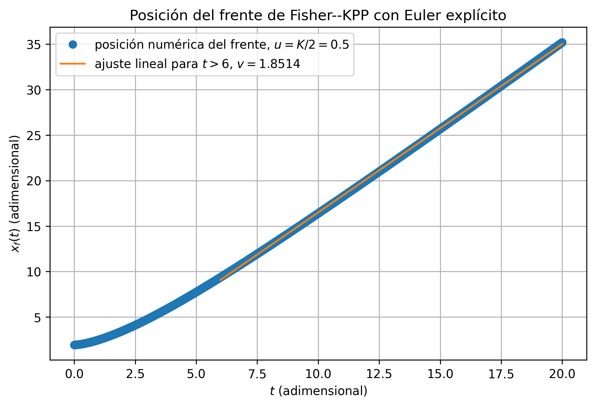

Esta figura representa la posición `x_f(t)` del frente, definida mediante el nivel `u = K/2`. La parte aproximadamente lineal indica que, tras un transitorio inicial, el frente se propaga con velocidad casi constante. La pendiente del ajuste lineal proporciona una estimación numérica de esa velocidad.

### `test_fisher_cn.py`

Este script resuelve la misma ecuación de Fisher--KPP, pero utilizando un esquema de Crank--Nicolson semimplícito. Al igual que en el caso de Euler explícito, genera gráficos de perfiles de la solución y de posición del frente.

El script genera:

- `resultados/fisher_kpp_cn_perfiles.png`
- `resultados/fisher_kpp_cn_posicion_frente.png`

### Figura: perfiles de Fisher--KPP con Crank--Nicolson semimplícito

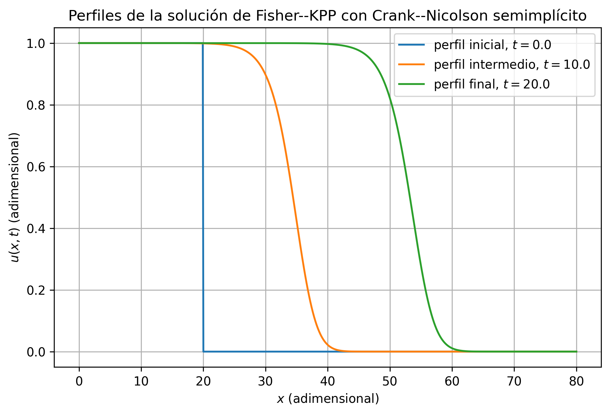

La figura permite observar la evolución del frente bajo el método semimplícito. Este esquema suele ser más estable que Euler explícito para la parte difusiva, por lo que resulta útil para comparar el comportamiento de ambos métodos numéricos.

### Figura: posición del frente con Crank--Nicolson semimplícito

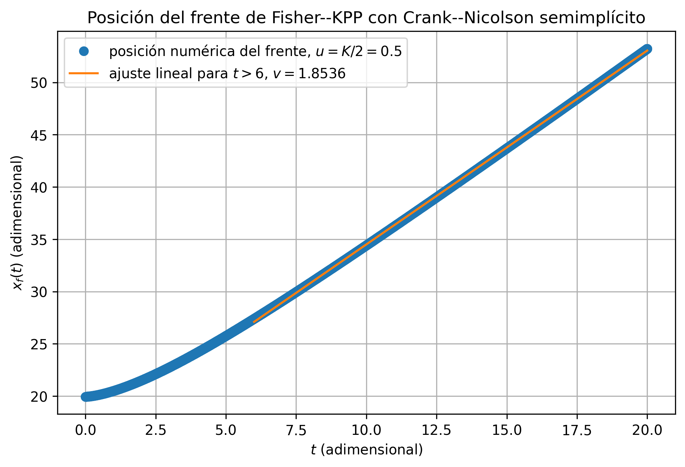

Como en el caso explícito, se representa la posición del frente y se ajusta una recta en la zona posterior al transitorio. La pendiente de la recta se interpreta como velocidad numérica de propagación.

## Corrección de Bramson para Fisher--KPP

### `bramson_fisher.py`

Este script estudia la velocidad efectiva del frente de Fisher--KPP en tiempos largos y la compara con una corrección tipo Bramson. Para ello resuelve la ecuación hasta `T = 100`, calcula la posición del frente `x_f(t)` y ajusta velocidades numéricas usando distintos tiempos iniciales `t0`.

La velocidad corregida que se compara en el script es:

```python
v_B(t0,T) = 2 - 3 log(T/t0) / (2 (T - t0))
```

El script imprime para varios valores de `t0`:

- la velocidad numérica ajustada,
- la velocidad corregida de Bramson,
- el error relativo entre ambas.

También genera:

- `resultados/fisher_kpp_bramson_T100.png`

### Figura: posición del frente y ajuste tipo Bramson

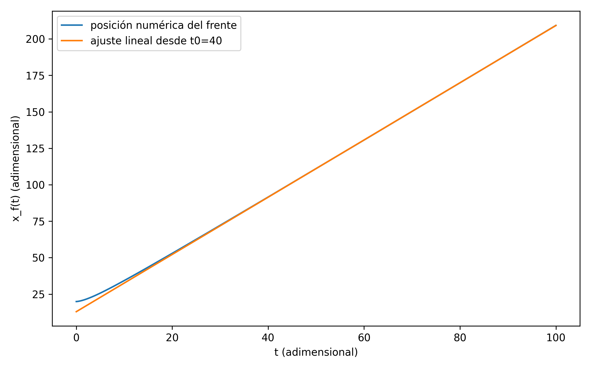

La figura muestra la posición numérica del frente y un ajuste lineal a partir de un tiempo `t0`. La comparación permite estudiar cómo la velocidad efectiva se aproxima al valor asintótico esperado, teniendo en cuenta que en Fisher--KPP la convergencia hacia la velocidad límite presenta correcciones logarítmicas.


## Comparación entre el modelo BARW y el sistema PDE de campo medio

Los scripts incluidos en `scripts/pde_barw/` construyen observables macroscópicos comunes para comparar el modelo estocástico BARW con su aproximación determinista de campo medio. La comparación se realiza a partir de un conjunto de 100 realizaciones BARW, correspondientes a las semillas `1000`--`1099`, y de la solución numérica del sistema PDE.

El procedimiento adapta funciones auxiliares del código de referencia facilitado por los tutores, especialmente para la construcción de perfiles longitudinales, el colapso en un marco móvil, el suavizado gaussiano y el cálculo de métricas. La integración con las clases del proyecto, la ejecución de los experimentos, el almacenamiento de los resultados, la generación de las figuras y su análisis se han realizado en este TFG.

### Posición y velocidad del frente

El frente BARW se calcula a partir del punto más avanzado alcanzado por la red depositada. Para la PDE se utiliza el último punto en el que la densidad activa satisface el umbral relativo `a(x,t) >= 0.08 a_max(t)`.

La comparación principal se realiza con la media BARW condicionada a supervivencia. En la ventana temporal `[60, 300]` se obtuvieron:

```text
V_BARW = 0.610179
V_PDE  = 0.607945
```

La diferencia relativa entre ambas velocidades es aproximadamente del `0.37 %`.

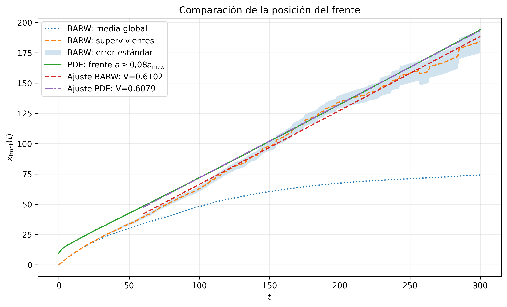

### Posición del pico activo

Como observable complementario se compara también la posición del máximo de la densidad activa. En el BARW, el pico se estima a partir del centro del intervalo espacial con mayor número de puntas activas; en la PDE se utiliza el máximo interpolado del campo `a(x,t)`.

Este observable presenta una mayor variabilidad que el frente, debido al carácter discreto del BARW, al número limitado de puntas activas y a la discretización longitudinal.

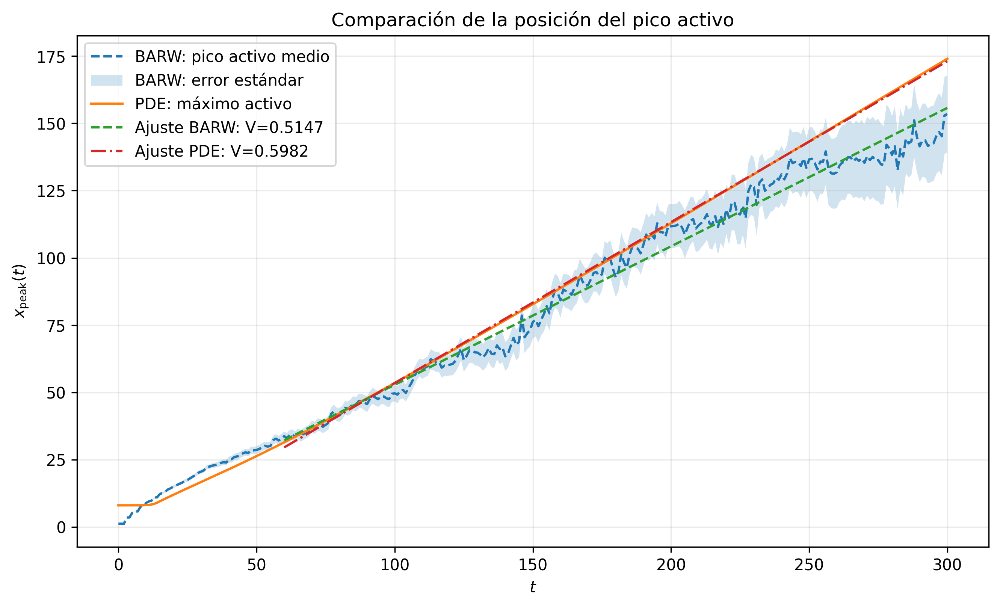

### Densidad de puntas activas

Para comparar la forma del pulso activo, cada realización superviviente se traslada al marco móvil `z = x - x_peak(t)` antes de interpolar y promediar los perfiles. Se representan tanto el perfil BARW sin suavizar como una versión suavizada mediante un núcleo gaussiano, junto con el error estándar y el perfil PDE normalizado.

```text
RMSE activo        = 0.100200
Correlación activa = 0.951707
```

Estos valores indican una concordancia elevada en la forma macroscópica del pulso activo.

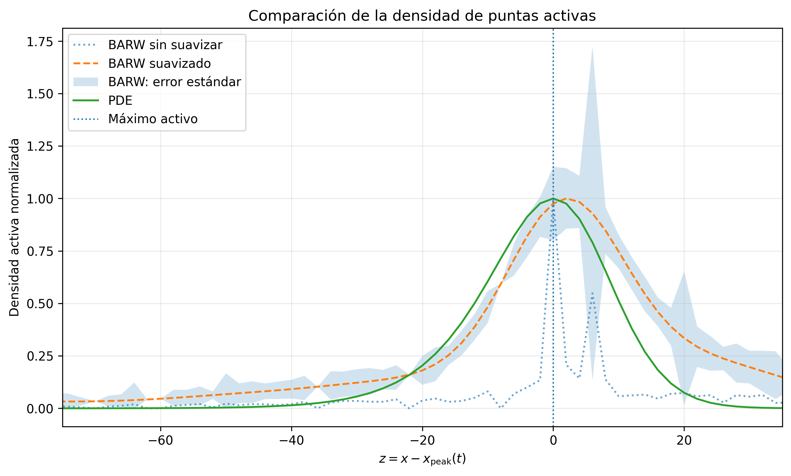

### Densidad de conductos

La densidad longitudinal de conductos BARW se construye acumulando la longitud de los segmentos asignados a cada intervalo espacial y normalizando por el área de la franja correspondiente. Los perfiles se alinean respecto del borde delantero de la red depositada.

```text
RMSE conductos        = 0.220792
Correlación conductos = 0.850832
```

La PDE reproduce la estructura general de la red depositada detrás del frente, aunque con una concordancia cuantitativa menor que en el caso de la densidad activa.

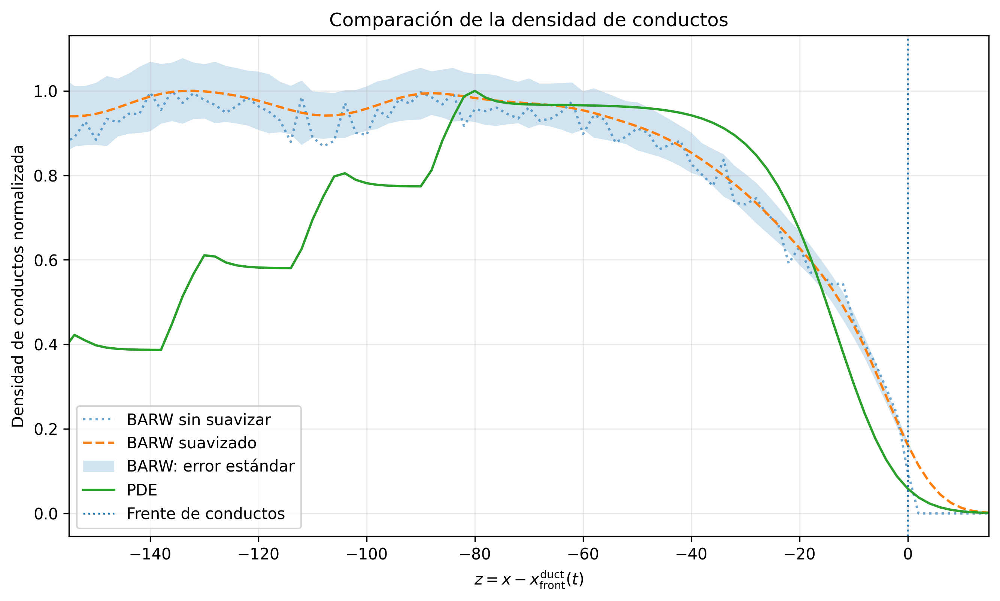

Los archivos numéricos utilizados en estas comparaciones se almacenan en `resultados/comparacion_barw_pde/`.


## Procedencia del código y contribuciones

Este repositorio combina código desarrollado durante el TFG con algunos scripts base facilitados por los tutores. La procedencia se mantiene explícita para distinguir el material de partida de las aportaciones realizadas en este trabajo.

| Componente | Procedencia | Trabajo realizado en este TFG |
|---|---|---|
| Código principal de `src/` y scripts de simulación y validación | Desarrollo realizado en el marco del TFG | Implementación, pruebas, documentación y análisis numérico. |
| Implementación del quadtree e integración en BARW | Desarrollo realizado en el marco del TFG | Diseño de la estructura, inserción incremental, consultas radiales, integración en el simulador y validación frente a la búsqueda exhaustiva. |
| `paquetes_cerrados/benchmark_escalabilidad_barw/` | Script base facilitado por los tutores | Adaptación a las clases del proyecto, integración del quadtree, ejecución de experimentos, generación de figuras, documentación y análisis de resultados. |
| Paquetes de reconstrucción de las Figuras 2 y 3 de Hannezo et al. | Scripts base facilitados por los tutores | Integración en el repositorio, organización de resultados, documentación, ejecución, generación de figuras y animaciones, y análisis de los resultados obtenidos. |

Los scripts base facilitados por los tutores se conservan dentro de `paquetes_cerrados/` y se identifican también en los `README` específicos de cada paquete. Las modificaciones, adaptaciones y resultados generados para este TFG se describen en esos documentos y en la memoria.

## Resultados complementarios facilitados por los tutores

Los siguientes resultados parten de **scripts base facilitados por los tutores del TFG**. Sobre ese material se realizaron la integración en el repositorio, la adaptación y documentación necesarias, la ejecución de los experimentos, la generación de las figuras y animaciones y el análisis de los resultados. Se incorporan como material complementario para comparar el modelo BARW con las figuras de Hannezo et al. (2017), manteniendo explícita su procedencia.

### Reconstrucción de la Figura 2

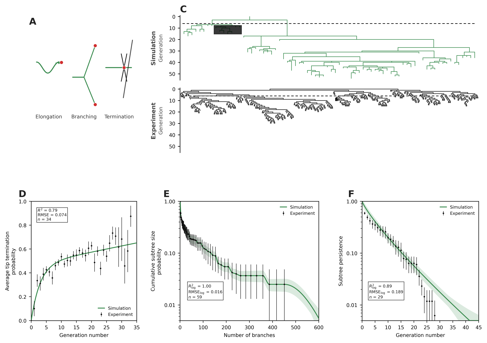

La composición reúne el esquema de los mecanismos del modelo BARW, la representación topológica de los árboles y las comparaciones estadísticas asociadas a los paneles D, E y F. El panel 2B no se incluye en esta lámina porque los datos suplementarios disponibles no contienen las coordenadas espaciales experimentales necesarias para reconstruirlo.

### Comparación entre el modelo continuo y BARW

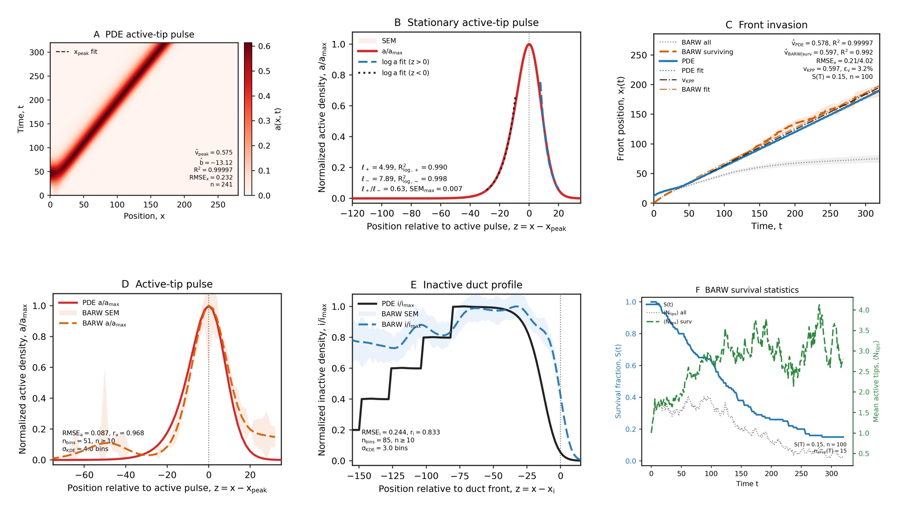

Esta figura presenta conjuntamente la aproximación continua mediante ecuaciones en derivadas parciales y la simulación estocástica BARW, permitiendo comparar ambas descripciones del crecimiento ramificado.

### Animaciones de la dinámica BARW

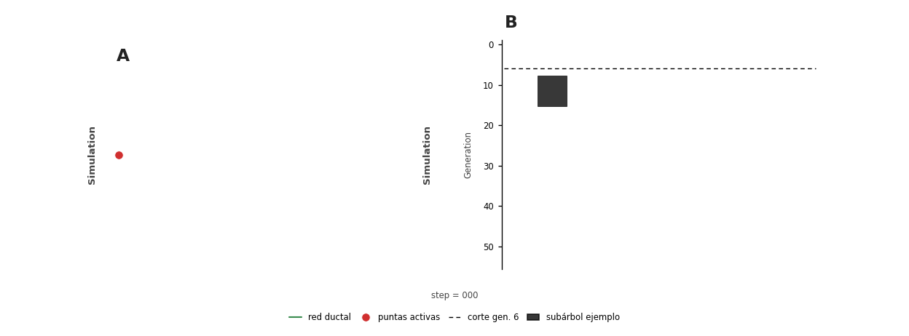

La animación muestra de forma sincronizada la evolución espacial de la red ductal y su representación topológica como árbol de ramas.

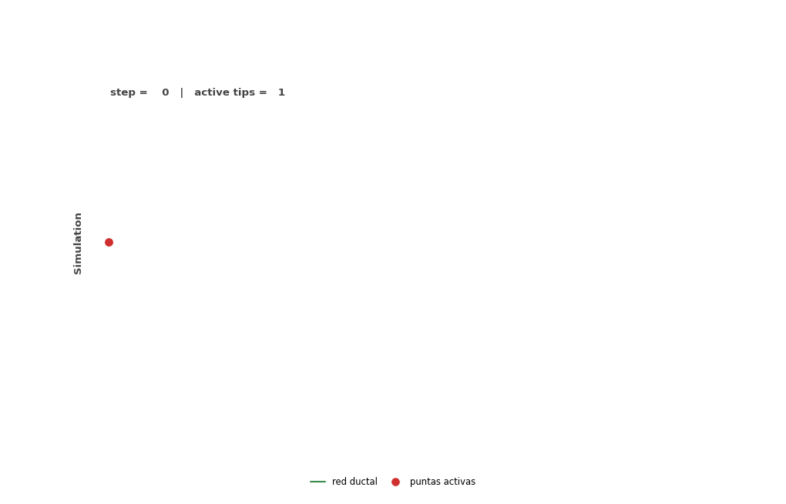

Esta animación permite observar paso a paso el avance de las puntas activas, las bifurcaciones y las terminaciones que determinan la geometría final de la red.

## Resumen de figuras generadas

| Script | Figura | Interpretación |
|---|---|---|
| `barw.py` | `barw_conducto_kdtree.png` | Geometría final del conducto ramificado generado por el modelo BARW. |
| `barw.py` | `barw_historial_kdtree.png` | Evolución de variables internas de la simulación, como puntas activas, bifurcaciones y terminaciones. |
| `benchmark_kdtree.py` | `benchmark_kdtree.png` | Comparación del coste de búsqueda exhaustiva y búsqueda con `cKDTree`. |
| `scripts/benchmark_completo_barw.py` | `benchmark_tiempo_vs_segmentos.png` | Comparación multisemilla del tiempo total de la simulación frente al número de segmentos. |
| `scripts/benchmark_completo_barw.py` | `benchmark_completo_barw.png` | Escalabilidad, aceleración y descomposición del coste para búsqueda exhaustiva, `cKDTree` y quadtree. |
| `test_fisher.py` | `fisher_kpp_euler_perfiles.png` | Evolución del perfil de Fisher--KPP con Euler explícito. |
| `test_fisher.py` | `fisher_kpp_euler_posicion_frente.png` | Estimación de la velocidad del frente mediante ajuste lineal. |
| `test_fisher_cn.py` | `fisher_kpp_cn_perfiles.png` | Evolución del perfil de Fisher--KPP con Crank--Nicolson semimplícito. |
| `test_fisher_cn.py` | `fisher_kpp_cn_posicion_frente.png` | Estimación de la velocidad del frente con el método semimplícito. |
| `bramson_fisher.py` | `fisher_kpp_bramson_T100.png` | Comparación entre la posición del frente y un ajuste relacionado con la corrección de Bramson. |
| `scripts/pde_barw/comparar_velocidad_pde_barw.py` | `comparacion_velocidad_frente_barw_pde.png` | Comparación de la posición y velocidad del frente BARW condicionado a supervivencia con el frente PDE. |
| `scripts/pde_barw/comparar_velocidad_pde_barw.py` | `comparacion_velocidad_pico_barw_pde.png` | Comparación complementaria de la posición del pico activo en ambos modelos. |
| `scripts/pde_barw/comparar_densidad_pde_barw.py` | `comparacion_densidad_activa_barw_pde.png` | Comparación de los perfiles normalizados de densidad de puntas activas en el marco móvil. |
| `scripts/pde_barw/comparar_densidad_pde_barw.py` | `comparacion_densidad_conductos_barw_pde.png` | Comparación de los perfiles normalizados de densidad de conductos depositados. |
| Scripts facilitados por los tutores | `figura_2ACDEF_sin_2B_colinda_layout.png` | Reconstrucción conjunta de los paneles A, C, D, E y F de la Figura 2 de Hannezo et al. |
| Scripts facilitados por los tutores | `fig3_pde_barw_box_layout.png` | Comparación visual entre la formulación continua PDE y la simulación BARW. |
| Scripts facilitados por los tutores | `figura_2BC_AB_simultanea_lenta.gif` | Evolución sincronizada de la geometría espacial y la topología del árbol. |
| Scripts facilitados por los tutores | `figura_2B_evolucion_temporal.gif` | Evolución temporal de la red ramificada generada por BARW. |

## Cómo reproducir los resultados

Desde la raíz del repositorio, ejecutar:

```bash
python barw.py
python benchmark_kdtree.py
python -m scripts.benchmark_completo_barw
python test_inicial.py
python test_cn.py
python test_fisher.py
python test_fisher_cn.py
python bramson_fisher.py
python -m scripts.pde_barw.generar_comparacion
python -m scripts.pde_barw.comparar_velocidad_pde_barw
python -m scripts.pde_barw.comparar_densidad_pde_barw
```

Los resultados gráficos y tablas se guardarán en la carpeta `resultados/`.

Los resultados complementarios anteriores se generan con los scripts incluidos en sus respectivos directorios dentro de `paquetes_cerrados/`. Cada paquete contiene un `README` específico con las instrucciones de ejecución, los parámetros utilizados y los archivos de salida.

## Comentario final

En conjunto, los scripts muestran la implementación del modelo BARW, la validación de los métodos numéricos y el estudio del rendimiento de distintas estrategias de búsqueda espacial. Los benchmarks comparan la búsqueda exhaustiva con `cKDTree` y con el quadtree implementado, mientras que los experimentos de Fisher--KPP y de la ecuación del calor permiten comprobar la consistencia de los esquemas numéricos. Los paquetes basados en scripts facilitados por los tutores amplían esta documentación con comparaciones visuales respecto al trabajo de Hannezo et al. (2017), manteniendo explícita la procedencia del código y las contribuciones realizadas en este TFG.
