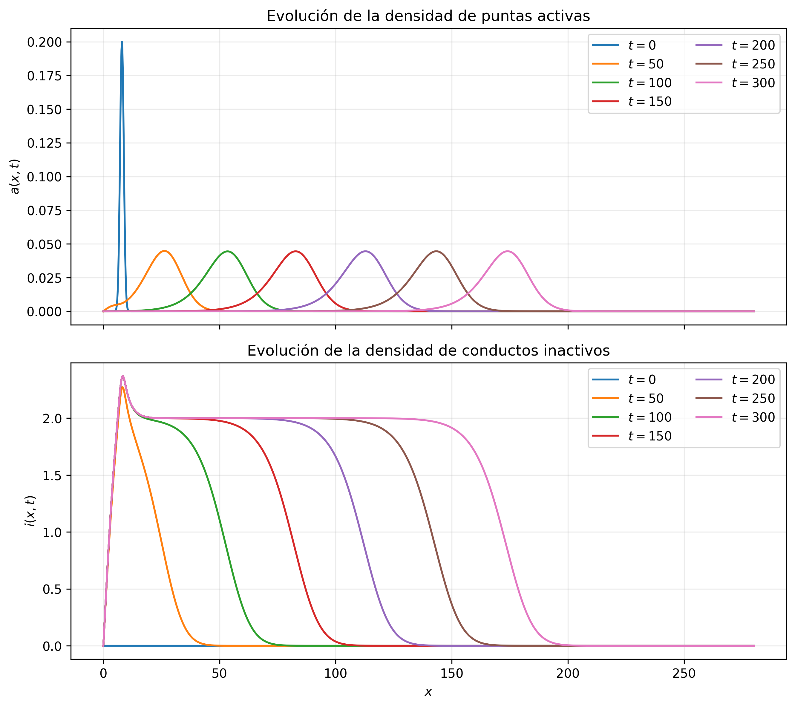

# Simulación BARW y ecuaciones de reacción-difusión

Este repositorio contiene una implementación numérica orientada al estudio de procesos de crecimiento ramificado tipo BARW (*Branching and Annihilating Random Walks*) y de modelos continuos de reacción--difusión relacionados. Incluye la ecuación del calor, Fisher--KPP y el sistema de campo medio de dos especies utilizado para comparar una descripción estocástica de agentes con una aproximación determinista suavizada.

Además de los solvers numéricos, el repositorio incorpora validaciones geométricas de la regla de terminación del BARW, benchmarks de búsqueda espacial mediante búsqueda exhaustiva, `cKDTree` y QuadTree, y un protocolo de comparación cuantitativa BARW--PDE.

## Estructura general

El código se organiza en torno a tres bloques principales:

1. **Simulación BARW**: generación de conductos ramificados mediante puntas activas que avanzan, se bifurcan y se desactivan por proximidad a conductos ya depositados o por salida del dominio.
2. **Modelos continuos de reacción--difusión**: resolución numérica de la ecuación del calor, Fisher--KPP y el sistema de campo medio de dos especies mediante diferencias finitas.
3. **Validación y experimentos**: comprobaciones de convergencia, validación geométrica, análisis multisemilla, benchmark integrado de búsqueda espacial y comparación BARW--PDE.

Las figuras, tablas y datos regenerables se guardan en `resultados/`. Los materiales complementarios basados en scripts facilitados por los tutores se conservan en `paquetes_cerrados/`.

## Requisitos

Se recomienda Python 3.10 o superior. Desde la raíz del repositorio:

```bash
python -m pip install --upgrade pip
python -m pip install -r requirements.txt
```

Las dependencias principales son `numpy`, `scipy`, `pandas`, `matplotlib` y `pytest`.

Los módulos propios se encuentran en `src/`, en particular `src.barw`, `src.campo_medio`, `src.malla`, `src.calor` y `src.fisherkpp`.

## Scripts principales

### `scripts/barw.py`

Este script ejecuta una simulación principal del modelo BARW. Primero crea una configuración mediante `BARWConfig`, después inicializa `SimulacionBARW` y finalmente ejecuta el modelo.

La estrategia de búsqueda espacial se selecciona mediante `metodo_busqueda`:

```python
metodo_busqueda = 0  # 0: exhaustiva, 1: cKDTree, 2: QuadTree
```

Las modalidades disponibles son:

- `0`: búsqueda exhaustiva, utilizada como referencia;
- `1`: búsqueda mediante `cKDTree`;
- `2`: búsqueda mediante QuadTree con inserción incremental.

Al finalizar, el script puede generar una representación espacial de la red y un historial temporal de magnitudes como el número de puntas activas, bifurcaciones y desactivaciones.

```bash
python -m scripts.barw
```


### Validación geométrica de la regla de terminación

El script `scripts/comparacion_pp_ps.py` compara dos criterios de proximidad:

1. **Punto--punto**: una punta propuesta se compara con los puntos de conducto almacenados.
2. **Punto--segmento**: la punta propuesta se compara con la distancia mínima a cada segmento completo.

La comparación utiliza 30 parejas de simulaciones con las mismas semillas y búsqueda exhaustiva, de modo que se aísla el efecto de la geometría de la detección de colisiones. Para la resolución espacial y el radio de aniquilación empleados, las medianas de las diferencias emparejadas fueron nulas en los observables globales analizados. Algunas trayectorias individuales divergen tras una diferencia local de colisión, como cabe esperar en un sistema estocástico acumulativo.

```bash
python -m scripts.comparacion_pp_ps
```

Los resultados se guardan en `resultados/comparacion_punto_punto_segmento/`.

### Validación con distintas semillas

El script `scripts/validacion_semillas.py` ejecuta un conjunto de realizaciones independientes del BARW para caracterizar la variabilidad entre redes. Registra, entre otros observables, segmentos, bifurcaciones, desactivaciones, tiempo final y avance máximo longitudinal.

También verifica el balance de puntas:

```text
N_act(n) = 1 + N_bif(n) - N_desact(n)
```

donde `N_desact` incluye las desactivaciones por proximidad y por salida de frontera. Esta identidad comprueba la coherencia contable del simulador, pero no constituye una estimación del balance generacional `q ≈ 0.5` estudiado en el trabajo de referencia.

```bash
python -m scripts.validacion_semillas
```

Los CSV principales se guardan en:

```text
resultados/validacion_semillas.csv
resultados/resumen_validacion_semillas.csv
```

## Benchmark de búsqueda espacial

### `scripts/benchmark_kdtree.py`

Este script realiza un benchmark geométrico estático y complementario entre búsqueda exhaustiva y `cKDTree` para consultas de vecinos dentro de un radio fijo. No es el resultado principal de rendimiento del TFG, pero sirve para ilustrar el efecto del particionado espacial sobre consultas radiales en conjuntos de puntos sintéticos.

```bash
python -m scripts.benchmark_kdtree
```

El script guarda, entre otros archivos:

- `resultados/resultados_kdtree.csv`;
- `resultados/benchmark_kdtree.png`.


### `scripts/benchmark_canonico_busquedas_barw.py`

El benchmark principal se realiza sobre la simulación BARW completa. Para 50 semillas emparejadas se ejecutan las tres estrategias:

1. búsqueda exhaustiva;
2. búsqueda mediante `cKDTree`;
3. búsqueda mediante QuadTree.

En cada ejecución se registran el tiempo total, número final de segmentos, bifurcaciones, desactivaciones, colisiones, salidas por frontera, puntas activas finales, avance longitudinal máximo, número de pasos y motivo de parada.

Antes de comparar los tiempos se verifica la equivalencia funcional: para las 50 semillas, `cKDTree` y QuadTree coinciden exactamente con la búsqueda exhaustiva en todos los observables registrados y en el motivo de parada. Por tanto, las diferencias de rendimiento se atribuyen únicamente al procedimiento utilizado para localizar candidatos cercanos.

| Método | Tiempo medio (s) | Desviación típica (s) | IC del 95 % (s) | Cociente respecto a exhaustiva |
|---|---:|---:|---:|---:|
| Exhaustiva | 0.536 | 0.987 | [0.255, 0.816] | 1.00 |
| `cKDTree` | 0.076 | 0.112 | [0.044, 0.108] | 7.08 |
| QuadTree | 0.035 | 0.049 | [0.021, 0.049] | 15.41 |

En este protocolo integrado, QuadTree presenta el menor tiempo medio, seguido de `cKDTree`. Este resultado está restringido al equipo, configuración, semillas, geometría y modo de actualización del índice utilizados; no demuestra una superioridad universal de QuadTree frente a `cKDTree`.

```bash
python -m scripts.benchmark_canonico_busquedas_barw
```

El script genera:

```text
resultados/benchmark_busquedas_barw.csv
resultados/resumen_benchmark_busquedas_barw.csv
resultados/diferencias_busquedas_barw.csv
resultados/benchmark_tiempo_busquedas.png
resultados/benchmark_tiempo_vs_segmentos.png
```

La figura frente al número de segmentos es un diagnóstico complementario del benchmark integrado.


## Validación de la ecuación del calor

### `scripts/script_inicial.py`

Este script valida el método de Euler explícito aplicado a la ecuación del calor unidimensional. Usa como dato inicial una función seno y compara la solución numérica con la solución exacta en el tiempo final.

También calcula el parámetro de estabilidad:

```python
lambda_ = D * dt / dx**2
```

que debe satisfacer la condición de estabilidad del esquema explícito. Se ejecutan refinamientos de malla y se calcula el error máximo para comprobar que disminuye al aumentar la resolución.

### `scripts/script_cn.py`

Este script realiza una validación análoga mediante Crank--Nicolson. Compara distintos refinamientos de malla y calcula el orden observado de convergencia a partir de los errores máximos.

Estas validaciones comprueban el comportamiento de los métodos básicos antes de aplicarlos a Fisher--KPP y al sistema de campo medio.

## Ecuación de Fisher--KPP

### `scripts/script_fisher.py`

Este script resuelve Fisher--KPP mediante Euler explícito. Usa un dato inicial tipo escalón, representa la evolución del perfil y estima la velocidad del frente a partir de un nivel de referencia.

La velocidad teórica de referencia es:

```python
v = 2 * sqrt(r * D)
```

El script genera:

- `resultados/fisher_kpp_euler_perfiles.png`;
- `resultados/fisher_kpp_euler_posicion_frente.png`.


### `scripts/script_fisher_cn.py`

Este script resuelve Fisher--KPP mediante un esquema semimplícito de Crank--Nicolson para la difusión. Genera perfiles y una estimación de la posición del frente, permitiendo contrastar el comportamiento con Euler explícito.

El script genera:

- `resultados/fisher_kpp_cn_perfiles.png`;
- `resultados/fisher_kpp_cn_posicion_frente.png`.


## Corrección de Bramson para Fisher--KPP

### `scripts/bramson_fisher.py`

Este script estudia la velocidad efectiva del frente de Fisher--KPP en tiempos largos y la compara con una corrección de tipo Bramson. Resuelve la ecuación hasta `T = 100`, calcula la posición del frente y ajusta velocidades numéricas usando distintos tiempos iniciales `t0`.

La corrección utilizada en el script es:

```python
v_B(t0, T) = 2 - 3 * log(T / t0) / (2 * (T - t0))
```

El script genera:

- `resultados/fisher_kpp_bramson_T100.png`.


## Sistema de campo medio de dos especies

El sistema de campo medio utilizado en el Capítulo 4 del TFG describe la densidad de puntas activas `a(x,t)` y la densidad de conductos inactivos `i(x,t)`:

```text
da/dt = D · d²a/dx² + rb · a · (1 - (a + i) / n0)
di/dt = re · a + (rb / n0) · a · (a + i)
```

Para el pulso principal se emplean:

```text
D = 1       rb = 0.1       re = 1       n0 = 1
L = 280     T = 300        dx = 0.2     dt = 0.02
```

La solución forma un pulso localizado de densidad activa que se desplaza hacia la derecha y deja detrás una región de densidad inactiva aproximadamente uniforme.

### Velocidad del pulso

La estimación principal sobre la ventana `[200, 300]` es:

```text
V_num = 0.611889
V_teórica = 2 · sqrt(D · rb) = 0.632456
Error relativo = 3.25 %
```

El análisis de sensibilidad respecto a malla, paso temporal, tamaño del dominio y ventana de ajuste muestra variaciones inferiores al `0.4 %` para la configuración estudiada. Este resultado respalda la robustez numérica de la estimación, pero no constituye una verificación exacta de la velocidad asintótica teórica.

### Asimetría de las colas

La predicción analítica bajo las aproximaciones `a << i` y `rb/re << 1` es:

```text
gamma_trasera / gamma_delantera = sqrt(2) - 1 ≈ 0.414214
```

El perfil colapsado del experimento principal proporciona:

```text
gamma_trasera / gamma_delantera = 0.630961
Error relativo = 52.33 %
```

Por tanto, el pulso reproduce cualitativamente la asimetría esperada —la cola trasera es más extensa que la delantera—, pero no verifica cuantitativamente la relación asintótica. Los análisis de sensibilidad con perfiles individuales siguen alejados del valor teórico.

Los scripts principales son:

```bash
python -m scripts.pde_barw.simular_pulso_pde
python -m scripts.pde_barw.analizar_velocidad_pde
python -m scripts.pde_barw.analizar_asimetria_pde
```

Los resultados se guardan en `resultados/campo_medio_cap4/`.



## Comparación entre el modelo BARW y el sistema PDE de campo medio

Los scripts de `scripts/pde_barw/` construyen observables longitudinales comunes para comparar la red bidimensional discreta BARW con la solución unidimensional continua de campo medio.

La comparación parte de 100 realizaciones BARW, con semillas `1000`--`1099`, y de la solución PDE anterior. La comparación principal se realiza sobre una cohorte fija formada por las 19 realizaciones que permanecen activas hasta `T = 300`. La fracción de supervivencia final es:

```text
S(300) = 0.19
```

La red BARW se proyecta sobre el eje longitudinal y se divide en 120 intervalos. La densidad activa se obtiene a partir del número de puntas activas de cada intervalo; la densidad de conductos se obtiene a partir de la longitud de los segmentos, asignados según su punto medio longitudinal. Para comparar formas macroscópicas, los perfiles se alinean en un marco móvil y se suavizan mediante núcleos gaussianos, conservando también los datos sin suavizar y sus errores estándar.

El procedimiento adapta funciones auxiliares del código de referencia facilitado por los tutores. La integración con el simulador, las modificaciones de configuración, la ejecución de los experimentos, la generación de figuras y el análisis de resultados se realizaron en el TFG.

### Posición y velocidad del frente

El frente BARW se define como el punto más avanzado de la red acumulada de conductos. En la PDE se usa el borde derecho de la región donde:

```text
a(x,t) >= 0.08 · a_max(t)
a_max(t) = máximo de a(x,t) sobre x
```

La comparación principal usa la cohorte fija de 19 redes supervivientes hasta `T = 300`, con ventana de ajuste `[150, 300]`:

```text
V_BARW = 0.740937
IC bootstrap BARW al 95 % = [0.673778, 0.801493]
V_PDE = 0.613423
Error relativo = 17.21 %
```

La velocidad PDE queda por debajo del intervalo bootstrap de la cohorte BARW fija. Por tanto, la comparación no muestra una concordancia cuantitativa precisa de la velocidad, aunque ambas descripciones se encuentran en la misma escala longitudinal de propagación.

Los análisis basados en supervivientes dinámicos se conservan como diagnóstico complementario: el conjunto de realizaciones que contribuye al promedio cambia con el tiempo y no se utiliza como resultado principal.


### Posición del pico activo

Como observable complementario se compara la posición del máximo de la densidad activa. En el BARW, el pico se estima mediante el centro del intervalo con mayor densidad de puntas activas; en la PDE se utiliza el máximo interpolado de `a(x,t)`.

Este observable presenta mayor variabilidad que el frente, debido al carácter discreto del BARW, la discretización longitudinal y el número finito de puntas activas.


### Densidad de puntas activas

Para comparar la forma del pulso activo, cada realización de la cohorte fija se traslada al marco móvil `z = x - x_peak(t)`. Se representan el perfil BARW sin suavizar, una versión suavizada mediante núcleo gaussiano, el error estándar y el perfil PDE normalizado.

```text
RMSE activo        = 0.132957
Correlación activa = 0.936602
```

Estos valores indican una concordancia elevada en la forma macroscópica suavizada del pulso activo, aunque persisten diferencias en las colas y fluctuaciones que el modelo continuo no reproduce.


### Densidad de conductos

La densidad longitudinal de conductos BARW se construye acumulando la longitud de los segmentos asignados a cada intervalo según su punto medio longitudinal. Los perfiles se alinean respecto del borde delantero de la red depositada.

```text
RMSE conductos        = 0.262157
Correlación conductos = 0.744147
```

La PDE reproduce parcialmente la estructura longitudinal de conductos, pero el BARW mantiene una meseta elevada durante una región más extensa. La densidad de conductos es acumulativa y conserva información de bifurcaciones, orientaciones, aniquilaciones y supervivencia que se pierde en la descripción continua unidimensional.


Los datos principales de esta comparación se almacenan en `resultados/comparacion_barw_pde/`.

## Procedencia del código y contribuciones

Este repositorio combina código desarrollado durante el TFG con algunos scripts base facilitados por los tutores. La procedencia se mantiene explícita para distinguir el material de partida de las aportaciones realizadas en este trabajo.

| Componente | Procedencia | Trabajo realizado en este TFG |
|---|---|---|
| Código principal de `src/` y scripts de simulación y validación | Desarrollo realizado en el marco del TFG | Implementación, pruebas, documentación y análisis numérico. |
| Implementación del QuadTree e integración en BARW | Desarrollo realizado en el marco del TFG | Diseño de la estructura, inserción incremental, consultas radiales, integración en el simulador y validación frente a la búsqueda exhaustiva. |
| `paquetes_cerrados/benchmark_escalabilidad_barw/` | Script base facilitado por los tutores | Adaptación a las clases del proyecto, integración del QuadTree, ejecución de experimentos, generación de figuras, documentación y análisis de resultados. |
| Paquetes de reconstrucción de las Figuras 2 y 3 de Hannezo et al. | Scripts base facilitados por los tutores | Integración en el repositorio, organización de resultados, documentación, ejecución, generación de figuras y animaciones, y análisis de los resultados obtenidos. |

Los scripts base facilitados por los tutores se conservan dentro de `paquetes_cerrados/` y se identifican también en los README específicos de cada paquete. Las modificaciones, adaptaciones y resultados generados para este TFG se describen en esos documentos y en la memoria.

## Resultados complementarios facilitados por los tutores

Los siguientes resultados parten de **scripts base facilitados por los tutores del TFG**. Sobre ese material se realizaron la integración en el repositorio, la adaptación y documentación necesarias, la ejecución de los experimentos, la generación de las figuras y animaciones y el análisis de los resultados. Se incorporan como material complementario para comparar el modelo BARW con las figuras de Hannezo et al. (2017), manteniendo explícita su procedencia.

### Reconstrucción de la Figura 2


La composición reúne el esquema de los mecanismos del modelo BARW, la representación topológica de los árboles y las comparaciones estadísticas asociadas a los paneles D, E y F. El panel 2B no se incluye en esta lámina porque los datos suplementarios disponibles no contienen las coordenadas espaciales experimentales necesarias para reconstruirlo.

### Comparación entre el modelo continuo y BARW


Esta figura presenta conjuntamente la aproximación continua mediante ecuaciones en derivadas parciales y la simulación estocástica BARW, permitiendo comparar ambas descripciones del crecimiento ramificado.

### Animaciones de la dinámica BARW


La animación muestra de forma sincronizada la evolución espacial de la red ductal y su representación topológica como árbol de ramas.


Esta animación permite observar paso a paso el avance de las puntas activas, las bifurcaciones y las terminaciones que determinan la geometría final de la red.

## Resumen de figuras generadas

| Script | Figura | Interpretación |
|---|---|---|
| `scripts/barw.py` | `barw_conducto_*.png` | Geometría final de una red ramificada generada por BARW. |
| `scripts/barw.py` | `barw_historial_*.png` | Evolución de variables internas, como puntas activas, bifurcaciones y desactivaciones. |
| `scripts/benchmark_kdtree.py` | `benchmark_kdtree.png` | Benchmark geométrico estático entre búsqueda exhaustiva y `cKDTree`. |
| `scripts/benchmark_canonico_busquedas_barw.py` | `benchmark_tiempo_busquedas.png` | Comparación integrada de tiempos para búsqueda exhaustiva, `cKDTree` y QuadTree. |
| `scripts/benchmark_canonico_busquedas_barw.py` | `benchmark_tiempo_vs_segmentos.png` | Diagnóstico de tiempo total frente al número final de segmentos. |
| `scripts/script_fisher.py` | `fisher_kpp_euler_perfiles.png` | Evolución del frente Fisher--KPP con Euler explícito. |
| `scripts/script_fisher.py` | `fisher_kpp_euler_posicion_frente.png` | Posición del frente y estimación de su velocidad con Euler. |
| `scripts/script_fisher_cn.py` | `fisher_kpp_cn_perfiles.png` | Evolución del frente Fisher--KPP con esquema semimplícito. |
| `scripts/script_fisher_cn.py` | `fisher_kpp_cn_posicion_frente.png` | Posición del frente Fisher--KPP con el esquema semimplícito. |
| `scripts/bramson_fisher.py` | `fisher_kpp_bramson_T100.png` | Comparación con una corrección de tipo Bramson. |
| `scripts/pde_barw/simular_pulso_pde.py` | `campo_medio_evolucion_pulso.png` | Formación de un pulso activo y una región inactiva depositada. |
| `scripts/pde_barw/comparar_velocidad_pde_barw.py` | `comparacion_velocidad_frente_barw_pde.png` | Comparación del frente BARW y PDE; la cohorte fija aporta el resultado principal. |
| `scripts/pde_barw/comparar_densidad_pde_barw.py` | `comparacion_densidad_activa_barw_pde.png` | Comparación de perfiles normalizados de puntas activas. |
| `scripts/pde_barw/comparar_densidad_pde_barw.py` | `comparacion_densidad_conductos_barw_pde.png` | Comparación de perfiles normalizados de conductos depositados. |
| Scripts facilitados por los tutores | `figura_2ACDEF_sin_2B_colinda_layout.png` | Reconstrucción conjunta de los paneles A, C, D, E y F de la Figura 2 de Hannezo et al. |
| Scripts facilitados por los tutores | `fig3_pde_barw_box_layout.png` | Comparación visual entre la formulación continua PDE y la simulación BARW. |
| Scripts facilitados por los tutores | `figura_2BC_AB_simultanea_lenta.gif` | Evolución sincronizada de la geometría espacial y la topología del árbol. |
| Scripts facilitados por los tutores | `figura_2B_evolucion_temporal.gif` | Evolución temporal de la red ramificada generada por BARW. |

## Cómo reproducir los resultados

Los comandos deben ejecutarse desde la raíz del repositorio mediante `python -m`. Ejecutar archivos individuales con rutas como `python barw.py` puede fallar porque los imports internos dependen de la estructura de paquetes del proyecto.

```bash
# Pruebas unitarias
python -m pytest -q
python -m pytest --cov=src --cov-report=term-missing

# Validaciones numéricas
python -m scripts.script_inicial
python -m scripts.script_cn
python -m scripts.script_fisher
python -m scripts.script_fisher_cn
python -m scripts.bramson_fisher
python -m scripts.probar_campo_medio

# BARW y búsqueda espacial
python -m scripts.barw
python -m scripts.comparacion_pp_ps
python -m scripts.validacion_semillas
python -m scripts.benchmark_canonico_busquedas_barw

# Pulso PDE y comparación BARW--PDE
python -m scripts.pde_barw.simular_pulso_pde
python -m scripts.pde_barw.analizar_velocidad_pde
python -m scripts.pde_barw.analizar_asimetria_pde
python -m scripts.pde_barw.generar_comparacion
python -m scripts.pde_barw.comparar_velocidad_pde_barw
python -m scripts.pde_barw.comparar_densidad_pde_barw
```

El orden final es importante:

1. `simular_pulso_pde` genera `resultados/campo_medio_cap4/solucion_pulso_campo_medio.npz`.
2. Los análisis de velocidad y asimetría PDE leen ese archivo.
3. `generar_comparacion` genera los CSV de `resultados/comparacion_barw_pde/`.
4. Los scripts de velocidad y densidad BARW--PDE leen esos CSV y generan las figuras comparativas.

Los archivos `.npz` y algunos CSV generados pueden estar ignorados por Git debido a su tamaño. El pipeline anterior permite regenerarlos desde un clon limpio.


## Comentario final

El repositorio documenta una implementación reproducible del modelo BARW, métodos numéricos para modelos de reacción--difusión y una comparación con el sistema de campo medio de dos especies. Los resultados muestran que la PDE reproduce observables longitudinales suavizados, especialmente la forma macroscópica del pulso activo, pero no captura con precisión la velocidad de la cohorte fija, la extinción aleatoria, las fluctuaciones entre realizaciones ni la geometría bidimensional individual.

Los benchmarks comparan búsqueda exhaustiva, `cKDTree` y QuadTree dentro de la simulación BARW completa, verificando primero que las tres estrategias preservan la dinámica para las semillas estudiadas. Los paquetes basados en scripts facilitados por los tutores amplían la documentación con comparaciones visuales respecto al trabajo de Hannezo et al. (2017), manteniendo explícita la procedencia del código y las contribuciones realizadas en este TFG.
